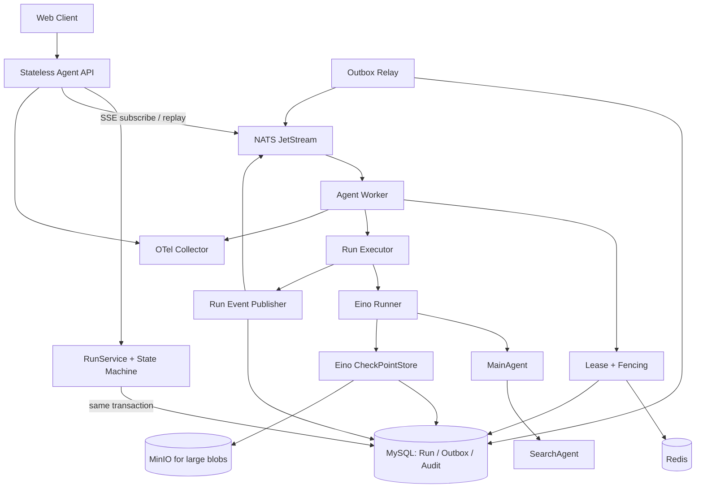
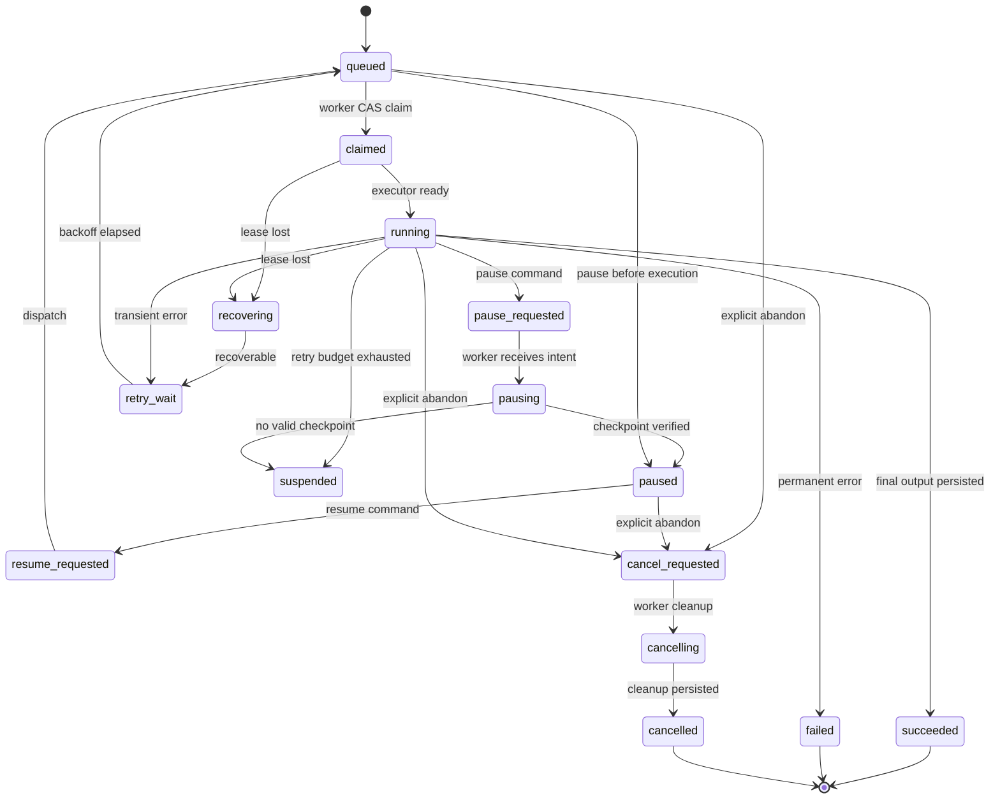
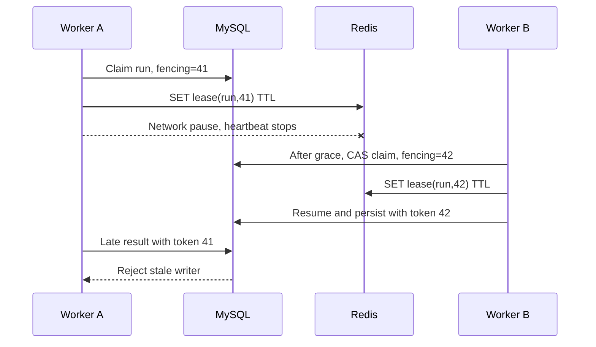
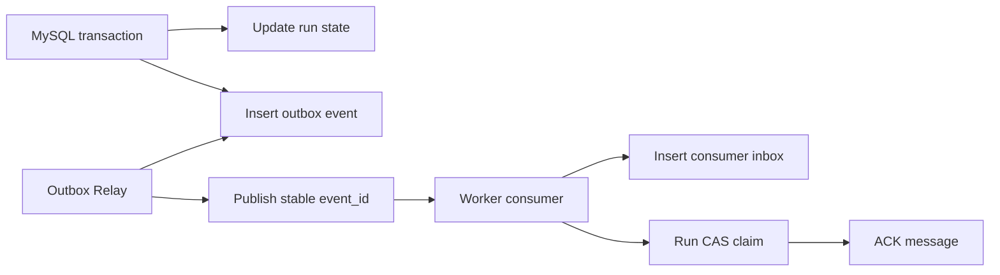
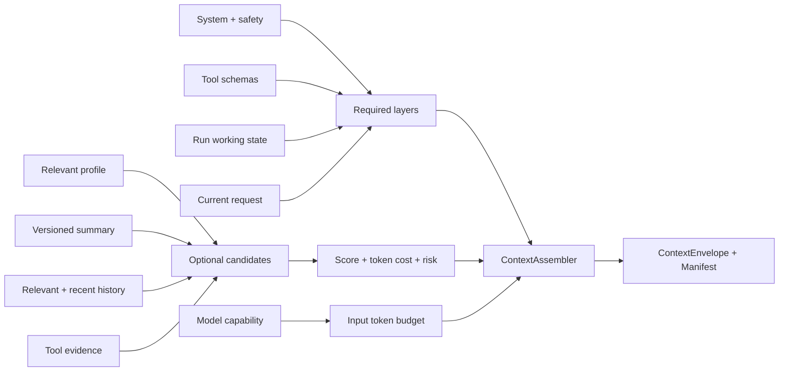
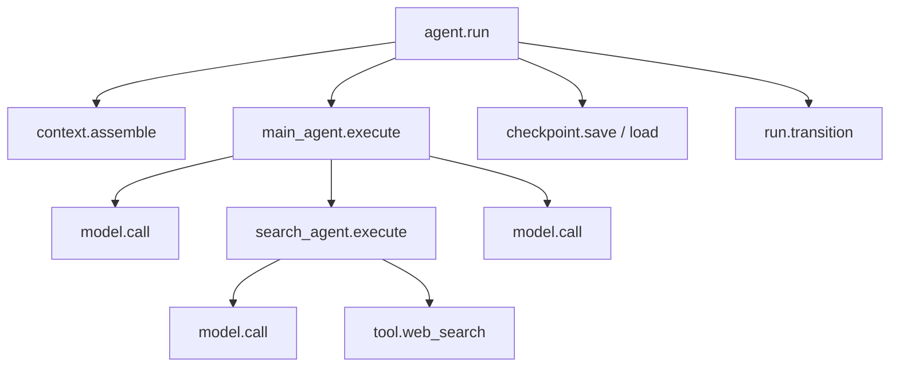
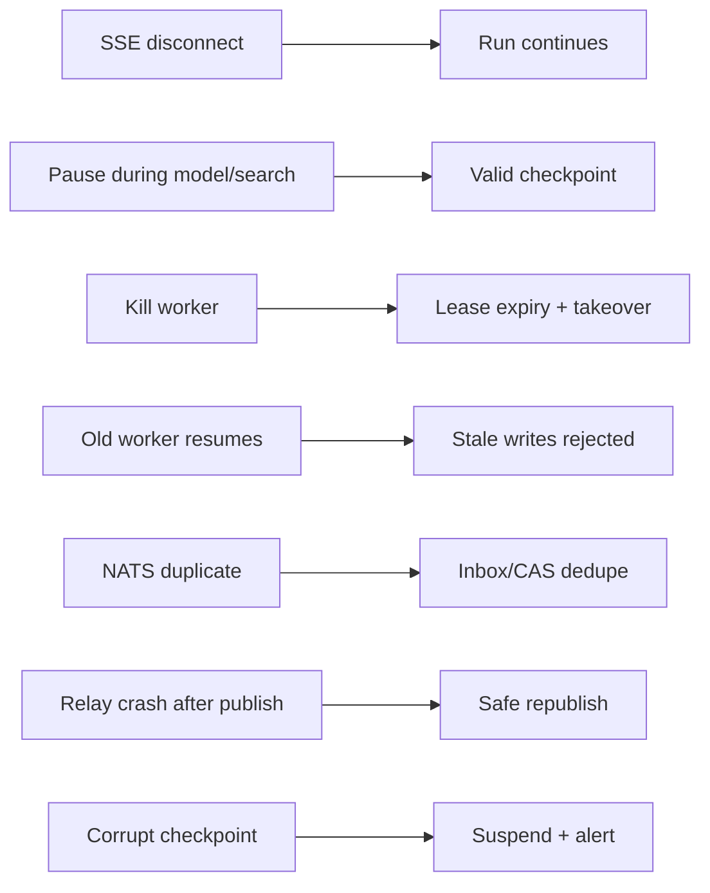
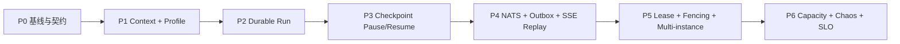

# MainAgent 与 SearchAgent 企业级 Harness 设计

**日期：** 2026-07-16

**状态：** 待用户审阅

**范围：** MainAgent 与 SearchAgent

**目标容量：** 峰值 100–300 个并发 Run、每月十万级 Run

**核心框架：** Go 1.25、Eino v0.9.4、MySQL、Redis、NATS JetStream、MinIO、OpenTelemetry

## 1. 执行摘要

本设计在现有 Eino Agent 外增加一个持久化 Run Harness。Eino 继续负责 ReAct 推理、模型调用、工具调用、安全点取消和内部 checkpoint 编解码；Harness 负责 Run 生命周期、上下文管理、用户画像、任务状态、可靠调度、暂停与恢复、多实例接管、幂等、重试、事件流和可观测性。

HTTP/SSE 连接不再拥有任务生命周期。API 创建持久化 Run 后即可返回 `run_id`；Worker 通过 NATS JetStream 领取任务，通过 MySQL 状态机和 fencing token 获得唯一执行权，通过 Eino `CheckPointStore`、`WithCheckPointID`、`WithCancel` 与 `Runner.Resume` 完成安全点暂停和恢复。

最终目标支持多实例接管，但按阶段交付：先建立上下文与持久化状态，再证明单实例 checkpoint 恢复，随后引入 NATS、Outbox、租约和 fencing，最后完成多实例故障接管与容量硬化。

## 2. 已确认的产品与技术决策

| 决策项 | 结论 |
|---|---|
| 恢复保证 | 从最近模型/工具安全点恢复 |
| “停止生成”语义 | 默认暂停，可继续 |
| 长期记忆 | 结构化用户画像 |
| 画像写入 | 混合策略：明确声明直接写，稳定偏好自动提取 |
| 画像治理 | 基础自助：查看、修改、删除、清空、总开关 |
| 短期上下文 | 分层 Token 预算 + 工作记忆 + 历史检索 |
| 部署目标 | 多实例接管，分阶段落地 |
| 消息系统 | NATS JetStream |
| 一致性 | MySQL 为事实源，Transactional Outbox 可靠发布 |
| Harness 首期范围 | MainAgent 与 SearchAgent，不迁移全站异步任务 |
| 可观测性 | OpenTelemetry 分布式追踪，不保存完整 Prompt 回放 |
| 异常恢复 | 分级自动恢复 |
| 容量档位 | 中等企业规模 |

## 3. 当前实现审计

### 3.1 已有能力

- `internal/agent/chat/context_builder.go` 已实现对话摘要、Redis 最近消息和 MySQL 降级读取。
- `pkg/cache/chat_cache.go` 已实现每个 conversation 最近 10 轮缓存和 Redis 锁。
- `internal/agent/search/agent.go` 已使用 Eino `WithCancel`，支持模型后安全取消、递归传播和取消超时。
- SearchAgent 已配置模型重试和基础 token/耗时日志。
- MySQL 保存 Conversation 与 Message，Redis 保存摘要和近期消息。
- 前端已通过 `AbortController` 与 `/stop` API 支持停止当前 SSE。
- Go 模块已包含 OpenTelemetry 和 Prometheus 相关依赖的传递版本。

### 3.2 关键缺口

- `chatAgentService.cancelFuncs` 是进程内 `sync.Map`，跨实例无法暂停。
- MainAgent Run 继承 HTTP request context；SSE 断线可能终止执行。
- Redis 锁 TTL 固定 120 秒，没有续租、owner 或 fencing，长任务和旧 Worker 复活均不安全。
- MySQL 不认识 Run、Attempt、Step、Checkpoint、Command 或 Event。
- MainAgent 直接调用 `ChatModelAgent.Run`，没有配置共享 `CheckPointStore` 或稳定 `checkpoint_id`。
- SearchAgent 虽使用 `Runner` 和 `WithCancel`，但没有 checkpoint store，因此取消后不能恢复。
- `context.WithoutCancel` 出现在触发式搜索/生成路径，会绕过 Run 生命周期。
- 摘要异步更新没有版本条件，旧任务可能覆盖新摘要。
- 固定 10 轮窗口按时间淘汰，不能保护早期关键约束。
- 可观测性以离散日志为主，缺少统一 trace、Run 级指标和状态审计。
- 当前分支中 MainAgent 与 SearchAgent 的实际注入链路需在基线阶段做契约测试；已有 `trigger_tools.go` 主要由未提交测试覆盖，应用装配未形成稳定 Harness 边界。

## 4. 范围与非目标

### 4.1 首期范围

- MainAgent Run 的创建、执行、暂停、继续、失败、重试和完成。
- SearchAgent 作为 MainAgent 的可观测、可 checkpoint 子步骤。
- MainAgent 与 SearchAgent 的上下文装配、Token 预算和结构化工作记忆。
- 用户画像的混合写入与基础自助管理。
- NATS 派发、持久化命令、Outbox、Inbox、租约、fencing 和恢复扫描。
- SSE 断线重连与事件补发。
- OTel trace、Prometheus 指标、Zap 关联日志与审计事件。

### 4.2 非目标

- 不把文件导入、ASR、向量入库、内容生成和有道笔记写入迁入统一 Harness。
- 不承诺外部搜索 API 的绝对 exactly-once。
- 不实现跨地域容灾。
- 不保存完整 Prompt、模型输出和网页正文用于执行回放。
- 不引入 Temporal、Kafka 或全新的工作流 DSL。
- 不把用户的 Notebook 内容或搜索结论沉淀成全局长期记忆。

## 5. 总体架构



### 5.1 职责边界

**Harness 拥有：**

- Run、Attempt、Step 状态机和状态版本。
- 调度、租约、fencing、重试预算和恢复策略。
- Pause、Resume、Cancel 命令及幂等请求。
- ContextAssembler、工作记忆、摘要与用户画像读取。
- Run 事件、审计、成本、配额和 OTel 关联。
- Agent 定义版本、Prompt 版本、工具集版本和模型配置快照。

**Eino 拥有：**

- Agent 内部 ReAct 循环。
- 模型与工具调用。
- 流式事件和子 Agent 事件。
- 安全点取消、递归取消传播和 `CancelError`。
- checkpoint 字节内容以及 `Runner.Resume`。

### 5.2 一致性原则

1. MySQL 是 Run 状态、命令意图和审计记录的事实源。
2. NATS 消息允许重复；消费者必须通过 event ID、状态 CAS 和 fencing 去重。
3. Redis 用于快速租约、限流和短期热点数据；Redis 数据丢失不得导致 Run 事实丢失。
4. 已开始执行的 Run 只有在 checkpoint 成功写入并通过 checksum 校验后才能进入 `paused`；尚未开始的 queued Run 可直接暂停，不需要 checkpoint。
5. 每次 Worker 持久化写入必须携带当前 fencing token。
6. Agent 定义、Prompt、工具集或模型配置不兼容时禁止盲目 Resume。

## 6. 运行数据模型

### 6.1 `agent_runs`

| 字段 | 说明 |
|---|---|
| `id` | UUIDv7，对外稳定 Run ID |
| `user_id` / `notebook_id` / `conversation_id` | 所有权与业务作用域 |
| `agent_type` | 首期固定为 `main` |
| `state` | 持久化状态枚举 |
| `desired_state` | `running`、`paused` 或 `cancelled`，命令事实 |
| `state_version` | 乐观锁版本 |
| `owner_worker_id` | 当前 Worker |
| `fencing_token` | 每次 claim 单调递增 |
| `lease_expires_at` | MySQL 中的租约镜像 |
| `current_attempt_id` | 当前 Attempt |
| `current_checkpoint_key` | 当前 Eino checkpoint 逻辑键 |
| `idempotency_key` | Run 创建去重键 |
| `input_json` | 用户请求与 Source IDs |
| `config_snapshot_json` | 模型、Agent、Prompt 与工具版本快照 |
| `retry_count` / `max_retries` | Run 级恢复预算 |
| `next_retry_at` | 退避截止时间 |
| `last_error_class/code/message` | 结构化终止原因 |
| `created_at/started_at/paused_at/finished_at` | 生命周期时间 |

### 6.2 `agent_run_attempts`

每次首次领取或恢复产生一个 Attempt，记录 `run_id`、attempt number、worker、fencing token、resume checkpoint、trace ID、开始/心跳/结束时间和终止原因。Attempt 不覆盖历史记录。

### 6.3 `agent_run_steps`

首期只持久化 MainAgent 与 SearchAgent 边界。字段包括 `id`、`run_id`、`attempt_id`、`parent_step_id`、`kind`、`agent_name`、`state`、`input_hash`、`tool_call_id`、`result_artifact_id`、`started_at`、`finished_at` 和错误分类。模型调用和普通工具调用只作为 OTel span，避免 Step 表过度膨胀。

### 6.4 `agent_checkpoints`

实现版本化 checkpoint：逻辑 key 对应多个不可变版本，`current` 指针原子切换。每个版本保存 Eino 版本、Agent 定义版本、Prompt 版本、工具集版本、模型配置 hash、存储类型、blob 或 MinIO URI、字节数、SHA-256、fencing token、创建时间和过期时间。

小 checkpoint 存 MySQL `LONGBLOB`；超过配置阈值时存 MinIO。阈值初始设为 1 MiB，并通过 checkpoint 大小指标校准。

### 6.5 可靠消息表

- `outbox_events`：`event_id`、aggregate、event type、payload、trace context、publish attempts、published time。
- `consumer_inbox`：`event_id + consumer_name` 唯一键，记录已完成消费。
- `agent_run_audit_events`：不可变状态转换与用户操作审计。
- `agent_run_events`：只持久化状态、步骤、搜索结果、完成和错误等语义事件；逐 token 事件由 NATS/Redis 短期保留。

### 6.6 上下文与画像表

- `conversation_summaries`：conversation、version、through message ID、摘要文本、token count、生成模型和创建时间。
- `user_profile_facts`：user、category、key、normalized value、confidence、source message、version、status 和更新时间。
- `agent_context_manifests`：run/step/model call、各层候选与入选 token、来源 ID、裁剪原因、最终 Prompt hash；不保存完整 Prompt。

## 7. Run 状态机



API 命令通过 `state + state_version` 条件更新 desired state；Worker 产生的状态、步骤、事件和 checkpoint 写入额外校验 `fencing_token`。条件更新失败表示状态已被并发命令或其他 Worker 改变，调用方必须重新读取后决定。

## 8. 安全点暂停与恢复

### 8.1 暂停流程

1. `POST /runs/:id/pause` 校验所有权和可暂停状态。
2. MySQL 事务将 `desired_state=paused`、`state=pause_requested`，并写 Outbox command。
3. Outbox Relay 发布 `RunPauseRequested` 到 NATS。
4. 当前 Worker 收到命令；即使消息未直达，heartbeat 也会读取 `desired_state`。
5. Worker 将状态改为 `pausing`，调用 Eino cancel function，模式为 `CancelAfterChatModel | CancelAfterToolCalls`、`WithRecursive()`、配置化超时。
6. Worker 持续 drain iterator，直到收到 `CancelError` 或执行结束。
7. Eino Runner 通过共享 `CheckPointStore` 保存 checkpoint。
8. Harness 校验 checkpoint key、checksum、fencing token 和版本元数据。
9. 校验通过后写 `paused`；校验失败写 `suspended` 并告警。

暂停 API 返回命令已接受，不把“请求成功”表述为“已暂停”。客户端通过 Run 状态事件看到最终 `paused`。

### 8.2 恢复流程

1. Resume API 只接受 `paused` 或人工批准的 `suspended`。
2. 已开始执行的 Run 校验 checkpoint 可读且与当前 Agent 定义兼容；执行前暂停的 Run 从原始输入重新入队。
3. 写 `resume_requested` 与 Outbox，随后进入 `queued`。
4. Worker 使用 MySQL CAS claim，递增 fencing token 并创建新 Attempt。
5. 按 Run 配置快照重建 MainAgent、SearchAgent、Prompt 和模型配置。
6. 配置相同 `CheckPointStore`，调用 `Runner.Resume(checkpoint_key)`。
7. 新事件携带新 Attempt ID；Run ID 保持不变。

### 8.3 CheckPointStore 适配

Eino 接口为 `Get(ctx, checkpointID)`、`Set(ctx, checkpointID, bytes)` 和可选 `Delete`。自定义 Store 从 context 提取 `run_id`、`attempt_id` 和 fencing token；`Set` 追加不可变版本并通过条件更新切换 current pointer。旧 Worker 的 token 不能更新 current pointer。

### 8.4 版本兼容

Resume 前比较：

- Eino major/minor checkpoint format version。
- MainAgent definition version。
- SearchAgent definition version。
- Prompt version。
- Tool schema set version。
- Model provider/model/config hash。

精确匹配可直接 Resume；明确声明 backward-compatible 的版本可由兼容矩阵放行；其他情况进入 `suspended`，允许用户选择从原请求重新运行。Run 中途不得通过 feature flag 切换执行协议。

## 9. Lease 与 Fencing



Redis lease用于快速活性判断；MySQL 保存 owner、lease expiry 和单调 fencing token。Recovery Scanner 只有在 MySQL lease 过期并经过 grace period 后才能 claim。所有 Run、Step、Event、Checkpoint current pointer 写入都携带 token 进行条件更新。

默认参数：heartbeat 每 5 秒，lease TTL 20 秒，recovery grace 10 秒。故障检测与重新 claim 的首期 p95 目标不超过 45 秒。

## 10. NATS JetStream 与可靠消息

### 10.1 Streams 与 Subjects

- `AGENT_RUNS` stream：`agent.run.dispatch.v1`、`agent.run.retry.v1`。
- `AGENT_COMMANDS` stream：`agent.worker.command.v1.<worker_id>`，按当前 owner 定向；MySQL desired state 是可靠兜底。
- `AGENT_EVENTS` stream：`agent.run.event.v1.<run_id>`，SSE 使用 exact subject 的 ephemeral consumer 做短期重放。
- `AGENT_DLQ` stream：超过 MaxDeliver 的派发与命令。

每个 Run 使用独立 subject，但不创建独立 Stream 或长期 durable consumer；NATS Stream 通过 wildcard 捕获全部 Run 事件。在线 SSE 创建有保留上限的 ephemeral consumer，断线后删除。Run ID 不作为 Prometheus label。Worker 对 dispatch stream 使用 durable pull consumer 和 queue group 横向扩展。

### 10.2 Outbox 流程



Relay 发布成功后标记 `published_at`，但 publish 后、mark 前崩溃会导致重复消息。Inbox 唯一键、Run CAS 和幂等 command ID 负责去重。Worker 在 claim 或命令状态持久化完成后 ACK。坏消息进入 DLQ，并产生带 Run ID 与 trace ID 的告警。

### 10.3 Command 可靠性

Pause/Resume/Cancel API 先写 `desired_state`，Outbox 根据事务内记录的 owner worker 发布定向 command。即使 owner 随后变化、消息丢失或目标 Worker 已退出，新 owner 在 claim 时和当前 owner 在 heartbeat 时都会读取 desired state，因此用户意图不会依赖单条消息。

## 11. 上下文管理

### 11.1 ContextEnvelope



计算公式：

`input_budget = model_context_window - reserved_output - serialized_tool_schema - safety_margin`

硬保留层按顺序放入：系统与安全策略、工具 schema、结构化工作状态、当前请求。若硬保留层本身超限，拒绝模型调用并记录配置错误，不静默裁剪安全策略。

软层候选评分：

`score = relevance + importance + recency + task_continuity - token_cost - trust_risk`

初始规则：画像最多占输入预算 5%；工具完整正文优先写 artifact，只注入摘要和引用；低相关历史先淘汰；最近轮次和相关旧历史共同竞争预算，不使用固定 10 轮作为唯一规则。

### 11.2 TokenCounter

定义 provider-aware `TokenCounter`。有精确 tokenizer 时使用精确计数；无精确实现时使用保守估算并扩大 safety margin。每个模型配置声明 context window、最大输出和 tokenizer strategy。生产环境出现 provider context length error 视为 SLO 违约。

### 11.3 结构化工作记忆

工作记忆属于 Run，不属于用户画像或对话摘要：

```json
{
  "goal": "回答当前用户问题",
  "current_step": "searching",
  "constraints": ["使用用户选定资料", "需要最新网络信息"],
  "completed_steps": ["context_assembled"],
  "pending_steps": ["search", "final_answer"],
  "artifacts": [{"id": "artifact-id", "kind": "search_results"}]
}
```

Harness 在 Agent 边界更新工作记忆；不保存模型隐藏思维链。工作记忆中的文本必须来自用户输入、工具结果或明确的系统决策。

### 11.4 MainAgent 与 SearchAgent 隔离

MainAgent 获得当前目标、工作状态、会话摘要、相关历史、相关画像和 SearchAgent 结构化结果。SearchAgent 只获得规范化搜索目标、时间/语言/来源约束、必要画像偏好和证据策略；不复制完整对话历史，降低噪声、Token 成本和 Prompt injection 面。

### 11.5 摘要一致性

每个摘要记录 `through_message_id` 和 version。摘要任务读取 expected version，更新使用乐观锁。旧异步任务不能覆盖新摘要。摘要生成失败不阻断 Run；ContextAssembler 回退到已存在摘要和历史检索，并记录 degraded 指标。

## 12. 用户画像长期记忆

### 12.1 允许内容

- 语言与回答风格。
- 专业背景与熟悉程度。
- 常用输出格式。
- 稳定工作方式和明确偏好。

禁止保存 API Key、密码、访问令牌、Cookie、验证码和私钥。Notebook 内容、临时搜索结果和当前任务状态不进入全局画像。

### 12.2 混合写入

- 用户明确说“记住我……”时立即创建或更新 fact。
- 推断 fact 必须属于白名单类别，置信度至少 0.90；低于阈值不写入。
- 同一 key 的冲突创建新版本并停用旧版本，不静默覆盖历史。
- 自动提取在成功 Run 后异步执行，不阻塞回答完成。

### 12.3 检索与注入

画像是小规模结构化集合，首期不使用向量数据库。ContextAssembler 根据当前任务需要的类别和 key 检索 active facts，按置信度与更新时间排序，并受 5% Token 上限约束。

### 12.4 用户控制

提供记忆总开关、列表、修改、单条删除和全部清除 API。删除使用事务更新状态并清除 Redis 缓存。关闭记忆后不提取新 fact，也不向 Prompt 注入旧 fact；数据保留到用户执行删除操作。

## 13. 取消、错误与重试

### 13.1 四种终止语义

| 事件 | 语义 | Run 结果 |
|---|---|---|
| SSE 断线 | detach | Run 继续 |
| 停止按钮 | pause | 安全点后 `paused` |
| 永久放弃 | cancel | `cancelled`，不可 Resume |
| Worker 下线 | drain/recover | 安全暂停或租约接管 |

`requestCtx` 只服务 API；Worker 创建独立 `runCtx`，Attempt 和 Step 使用其子 context。业务 Pause 使用 Eino cancel safe-point，不把普通 `context.CancelFunc` 当作可恢复暂停协议。进程硬退出时使用 context cancel 做资源回收，恢复由持久化状态和 lease expiry 负责。

### 13.2 错误分类

- `transient`：网络、429、可恢复 5xx，指数退避重试。
- `worker_lost`：lease 过期或进程崩溃，从 checkpoint 接管。
- `resource`：预算、配额或系统过载，进入 `suspended`。
- `permanent`：无效配置、参数或权限，进入 `failed`。
- `user_pause`：进入 `paused`，不消耗重试预算。
- `checkpoint_incompatible/corrupt`：进入 `suspended`，禁止自动重跑副作用。

### 13.3 重试预算

- 模型层瞬时错误最多重试 2 次。
- SearchAgent Attempt 最多 3 次，指数退避带 jitter。
- Run worker recovery 最多 3 次。
- Run 同时受总 wall time、Token、搜索调用次数和费用预算约束。
- 下层将实际重试次数上报 Harness；上层按总预算扣减，避免乘法重试。

### 13.4 幂等

Run 创建、Pause、Resume 和 Cancel 接受客户端 idempotency key 或 command ID。Search Step 使用：

`tenant + run + step + operation + normalized_input_hash`

完成的 Search Step 保存 query hash、tool call ID 和 artifact。恢复时优先复用已持久化结果。若外部搜索成功后、结果落库前崩溃且供应商不支持幂等键，允许受预算约束的重复调用，并通过 `duplicate_external_call_total` 指标告警；不宣称绝对 exactly-once。

## 14. 事件与 API

### 14.1 API

- `POST /api/v1/chat/conversations/:conversationId/runs`：创建 Run，返回 `202`、Run ID 和事件 URL。
- `GET /api/v1/agent/runs/:runId`：读取权威状态。
- `GET /api/v1/agent/runs/:runId/events`：SSE 订阅，支持 `Last-Event-ID`。
- `POST /api/v1/agent/runs/:runId/pause`：持久化暂停意图。
- `POST /api/v1/agent/runs/:runId/resume`：校验 checkpoint 后重新入队。
- `POST /api/v1/agent/runs/:runId/cancel`：显式永久放弃。
- `GET/PATCH/DELETE /api/v1/profile/memories`：用户画像管理。

旧 `POST /chat/conversations/:convId/messages` 在迁移期作为兼容适配器：内部创建 Run 并立即订阅事件，不再直接拥有 Agent goroutine。

### 14.2 事件信封

每个事件包含 `event_id`、`run_id`、`attempt_id`、`step_id`、`sequence`、`type`、`timestamp`、`payload` 和 `trace_id`。语义事件持久化；token chunk 在 NATS/Redis 保留 24 小时。超过 token 事件保留期后，客户端读取已保存的最终 assistant message 和语义事件，不要求永久重放逐 token 动画。

## 15. 可观测性



### 15.1 Trace

HTTP 使用 W3C `traceparent`；Outbox payload 保存 trace context；NATS headers 传播 context。异步 Attempt 不创建无限长父 span，而是使用 span link 关联原始请求和前一 Attempt。

### 15.2 指标

- Run：队列等待、运行时长、状态停留、成功/失败/暂停率。
- 恢复：Pause 接受/完成延迟、checkpoint 大小/耗时、Resume 成功率、接管次数。
- 模型：延迟、token、重试、费用、provider/model family。
- 上下文：预算利用率、各层候选/入选/裁剪 token、摘要与画像命中率。
- NATS：consumer lag、redelivery、DLQ、publish failure。
- MySQL/Redis：Outbox backlog、CAS 冲突、lease heartbeat 和连接池。

Run ID 和 User ID 不作为 Prometheus label。Label 只使用有限枚举：agent、provider、model family、state、error class 和 operation。

### 15.3 日志与审计

Zap 自动携带 `trace_id`、`run_id`、`attempt_id`、`step_id`、`worker_id` 和 `error_code`。普通日志不记录完整 Prompt、网页正文或画像值。审计表记录用户操作、命令 ID、状态前后值、Actor、时间和来源 IP 的受控表示。

### 15.4 观测后端

应用只依赖 OTel SDK。OTel Collector 接收 telemetry；Prometheus 保存指标，Tempo 保存 trace，Grafana 展示。日志先保留现有 Zap 输出，可在多实例阶段接入 Loki。

## 16. 初始 SLO

| 目标 | 初始门槛 |
|---|---|
| `queued → claimed` | p95 ≤ 2 秒 |
| Pause API 接受 | p95 ≤ 500 毫秒 |
| 正常安全暂停完成 | p95 ≤ 15 秒，受当前外部调用上限约束 |
| Worker 故障检测与重新 claim | p95 ≤ 45 秒 |
| 兼容 checkpoint Resume | 成功率 ≥ 99% |
| 生产上下文超窗 | 0 次 |
| 重复 dispatch 的有效重复执行 | 0 次 |

这些门槛在容量压测后按真实模型与搜索供应商延迟校准，但降低门槛必须形成变更记录。

## 17. 安全与数据治理

- 所有 Run、事件、checkpoint、artifact 和画像 API 校验 user ownership。
- Checkpoint 和 artifact 不写日志；MinIO 使用私有 bucket 与短期签名 URL。
- Profile value 和 checkpoint blob 使用应用层 envelope encryption 或数据库/对象存储加密能力；密钥沿用项目密钥管理规范，不复用普通 JWT secret。
- NATS 启用账号、TLS、subject 级权限和独立 API/Worker credential。
- OTel attributes 使用 allowlist；用户标识在 telemetry 中使用不可逆内部 hash。
- 来自网页和工具的文本标记为 untrusted evidence，不能覆盖系统策略或用户确认约束。
- checkpoint 与 token 事件有保留期和清理 Job；审计保留期独立配置。

## 18. 测试策略

### 18.1 单元测试

- 状态转换表和非法转换。
- CAS、fencing 和 idempotency key。
- 错误分类与统一重试预算。
- Token 预算、评分、裁剪和硬层超限。
- 摘要版本冲突。
- 用户画像写入、冲突、开关和删除。

### 18.2 集成测试

- MySQL Run/Attempt/Checkpoint/Outbox 事务。
- NATS durable consumer、重复投递、NAK、MaxDeliver 和 DLQ。
- Redis lease、heartbeat、过期和恢复扫描。
- Eino CheckPointStore `Get/Set/Delete`。
- SSE `Last-Event-ID` 重放。
- MinIO 大 checkpoint 和 checksum。

### 18.3 Eino 契约测试

- MainAgent 在 model safe-point Pause 后生成 checkpoint。
- SearchAgent 运行中递归 Pause，checkpoint 包含子 Agent 恢复上下文。
- `Runner.Resume` 从同一逻辑 checkpoint key 继续。
- immediate escalation 后 checkpoint 可用性。
- Agent、Prompt 和工具版本不兼容时拒绝 Resume。

### 18.4 故障注入



必须覆盖 SSE 断线、模型调用中暂停、SearchAgent 中暂停、Worker 硬崩溃、旧 Worker 复活、NATS 重复、Outbox 发布中崩溃、checkpoint 损坏和版本不兼容。

### 18.5 Agent 质量评测

- 历史关键约束召回率。
- 摘要事实一致性和遗漏率。
- 用户画像自动写入 precision；错误画像写入视为高严重度回归。
- SearchAgent 结构化结果完整率和搜索轮次。
- Token、延迟和费用相对基线的回归。
- Pause/Resume 前后最终回答一致性与引用完整性。

## 19. 分阶段落地



### P0：基线与兼容契约

- 为当前 MainAgent、SearchAgent、SSE、停止、摘要和历史加载补齐行为测试。
- 验证并固定 MainAgent→SearchAgent 实际装配路径。
- 引入 Agent、Prompt、工具集版本常量和 feature flags。
- 建立 Run ID、Trace ID 和结构化错误码规范。

**退出条件：** 旧行为由自动测试描述，SearchAgent 能从 MainAgent 稳定调用，现有接口行为有快照基线。

### P1：上下文与用户画像

- 实现 ContextAssembler、TokenCounter、ContextManifest。
- 引入版本化摘要和结构化工作记忆。
- 实现 `user_profile_facts`、混合写入与自助 API。
- 先 shadow 生成 manifest，再按用户灰度替换 ContextBuilder。

**退出条件：** 上下文超窗为 0，关键约束召回和 token 成本通过基线评测。

### P2：持久化 Run 与单实例 Worker

- 增加 Run、Attempt、Step、Event、Audit 与 Outbox 数据模型。
- API 改为创建 Run，单实例 Worker 使用数据库轮询或进程内 dispatcher 执行。
- SSE 与 Run 生命周期解耦，支持状态读取和事件序号。

**退出条件：** SSE 断线不终止 Run，重复创建请求不产生重复 Run，状态机无非法转换。

### P3：Checkpoint Pause/Resume

- 实现版本化 Eino CheckPointStore。
- MainAgent 改用 Eino Runner，传入稳定 checkpoint key 和 `WithCancel`。
- SearchAgent 共用 Run checkpoint 体系。
- 实现 Pause/Resume API、兼容矩阵和 checkpoint 清理。

**退出条件：** 单实例重启和用户 Pause 后均可从安全点恢复，损坏 checkpoint 会安全 suspended。

### P4：NATS、Outbox 与事件重放

- 部署 NATS JetStream，创建 versioned streams 和 durable consumers。
- 实现 Outbox Relay、Consumer Inbox、DLQ 和事件重放。
- API/Worker 可作为同一二进制的不同 role 启动。

**退出条件：** 重复投递、Relay 崩溃和 NATS 短暂不可用不会丢失 Run 或产生重复有效执行。

### P5：多实例 Lease、Fencing 与接管

- 实现 Redis 快速 lease、MySQL lease mirror、heartbeat、Recovery Scanner 和 fencing。
- 所有 Run/Step/Event/Checkpoint 写入校验 fencing token。
- 实现 Worker drain 和滚动发布流程。

**退出条件：** Worker 硬崩溃可在 SLO 内接管；旧 Worker 复活无法写入；滚动发布不中断可恢复 Run。

### P6：容量与生产硬化

- 完成 100–300 并发 Run 压测。
- 完成故障注入矩阵、SLO 仪表盘、告警和 Runbook。
- 按 5%、25%、50%、100% 稳定用户分桶灰度。
- 完成 checkpoint、事件、Outbox 和审计数据清理策略。

**退出条件：** 正确性、容量和运维门禁全部通过，并完成一次生产式接管演练。

## 20. Feature Flags 与回滚

- `agent_harness_enabled`
- `context_assembler_enabled`
- `profile_memory_enabled`
- `checkpoint_pause_enabled`
- `nats_dispatch_enabled`
- `multi_instance_recovery_enabled`

Flag 按用户稳定分桶并记录审计。Run 创建时把协议和 flag 快照写入配置快照，中途不切换。

回滚只停止新 Run 进入 Harness；已有 Run 继续完成或安全暂停。不得在回滚时删除 Run、Checkpoint、Outbox 或 Event 表。旧聊天接口通过 compatibility adapter 继续读取最终消息。

## 21. 风险与缓解

| 风险 | 缓解 |
|---|---|
| Eino checkpoint 跨版本不兼容 | 版本快照、兼容矩阵、拒绝盲目 Resume |
| 旧 Worker 复活写入 | MySQL fencing token 覆盖所有持久化写 |
| MQ 重复形成重复任务 | Outbox stable event ID、Inbox、Run CAS、幂等命令 |
| 摘要漂移或覆盖 | `through_message_id`、版本化、乐观锁、质量评测 |
| 上下文裁掉关键约束 | 硬保留层、重要性标记、manifest 和回归集 |
| Prompt injection 进入历史 | untrusted evidence 标记、来源隔离、系统策略硬保留 |
| 自动画像误记 | 白名单类别、0.90 阈值、来源、版本和用户删除 |
| 重试风暴与费用失控 | 统一重试预算、wall time/token/search/cost 上限 |
| Token 事件存储膨胀 | NATS/Redis 24 小时保留，永久只存语义事件和最终消息 |
| 当前主/子 Agent 装配不稳定 | P0 契约测试先固定真实执行链路 |

## 22. 详细图保存位置

Visual Companion 原始页面保存在：

`/.superpowers/brainstorm/harness-architecture-20260716/content/`

| 文件 | 内容 |
|---|---|
| `harness-architecture-options.html` | 三种架构路线对比 |
| `harness-architecture-design-section-1.html` | 总体架构与职责边界 |
| `context-memory-design-section-2.html` | 上下文与用户画像 |
| `run-state-recovery-design-section-3.html` | 状态机与安全点恢复 |
| `cancel-retry-design-section-4.html` | 取消、重试、Outbox 与幂等 |
| `observability-design-section-5.html` | Trace、指标、审计与 SLO |
| `rollout-testing-design-section-6.html` | 阶段、测试、故障注入与灰度 |

`.superpowers` 已被 `.gitignore` 忽略，避免 server state 中的本地访问 key 被提交。本文档内的 Mermaid 图是可版本化的长期副本。

## 23. 验收定义

设计实现完成必须同时满足：

1. SSE 断线后 Run 继续，客户端可重连读取状态和保留期内事件。
2. 用户停止后只有 checkpoint 验证成功才显示 `paused`，随后可 Resume。
3. Worker 崩溃后其他实例在 SLO 内接管；旧 Worker 的写入被 fencing 拒绝。
4. NATS 重复投递和 Outbox 重发不会产生重复有效 Run 或状态转换。
5. MainAgent 与 SearchAgent 的兼容 checkpoint Resume 成功率达到 99%。
6. ContextAssembler 不产生超窗请求，并能解释每次裁剪。
7. 用户可查看、修改、删除、清空和关闭画像记忆。
8. 任何 Run 均可通过 Run ID 定位状态、Attempt、Step、checkpoint、trace、结构化日志和审计事件。
9. 100–300 并发 Run 压测无持续队列积压或数据库连接池耗尽。
10. 所有故障注入、灰度回滚和运维 Runbook 演练通过。
