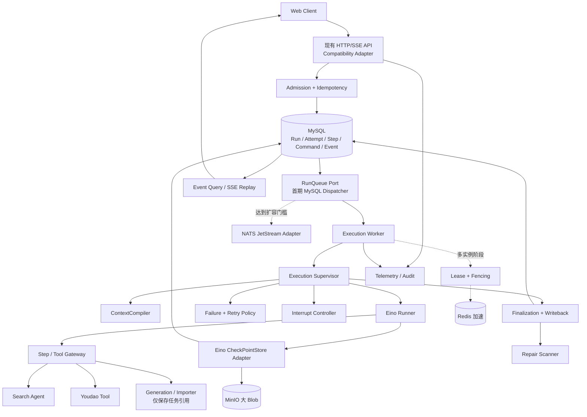
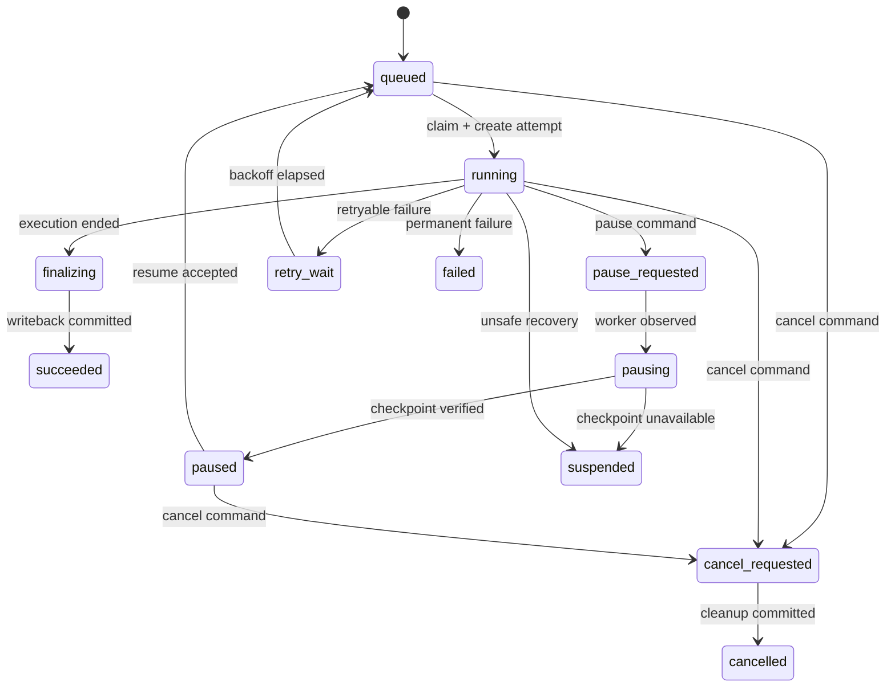
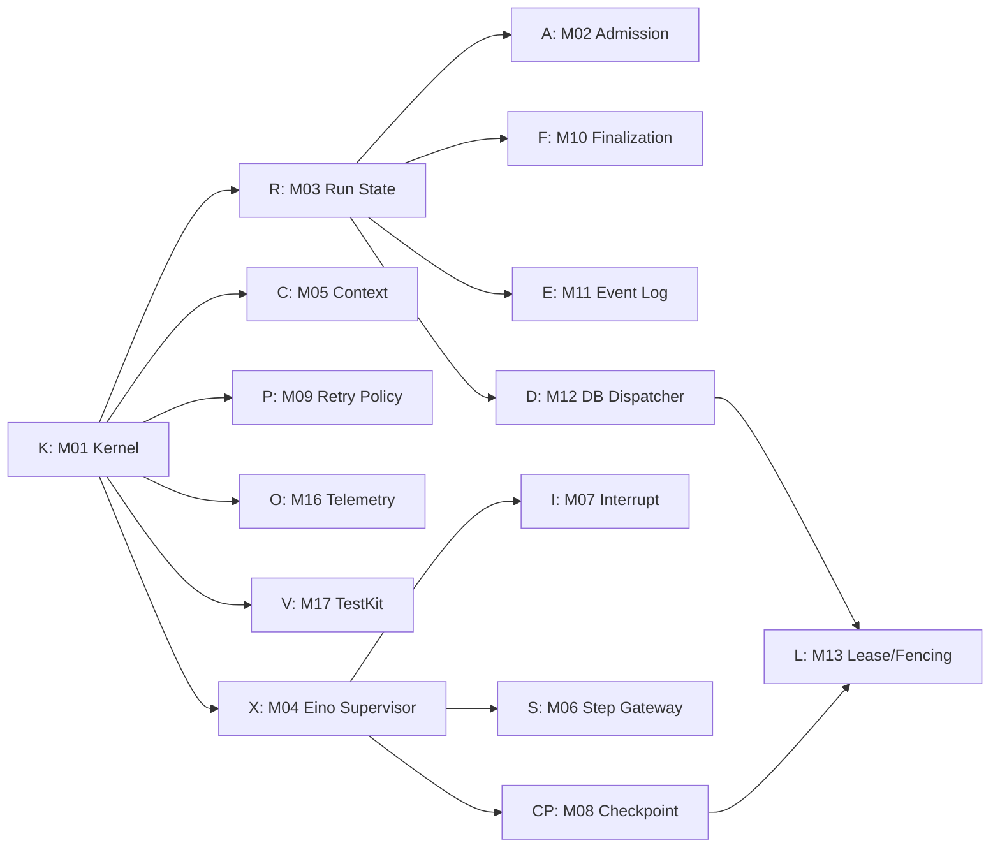

# YoudaoNoteLM 项目级 Agent Harness 工程化架构

## 1. 文档状态

- 日期：2026-07-28
- 状态：待用户批准；批准前不得据此开始实现
- 审计基线：`903f655 feat(agentcontext): add minimal persistent harness`
- 适用范围：Chat Agent、Main Agent、Search Agent 及其工具边界
- 设计目标：给出适合本项目的完整 Harness 模块边界，但只按需要分阶段实现
- 与已有文档的关系：
  - 本文取代尚未批准的 `2026-07-16-agent-harness-design.md`，成为项目级 Harness 的候选总设计。
  - 已批准的 `2026-07-25-agent-context-management-design.md` 继续有效；本文只定义它如何接入总 Harness。

本文中的“模块”是职责和依赖边界，不等于独立微服务，也不要求一开始建立同等数量的 Go 包。目标是允许上下文、重试、中断恢复、事件等能力由不同工作流独立实现，同时避免各自发明不兼容的 Run、状态和幂等语义。

## 2. 结论

本项目不需要先实现完整 Harness，才可以实现上下文管理或其他模块。需要先确定的只有一个很薄的 Harness Kernel：

- `RunID`、`AttemptID`、`StepID` 与父子关系；
- Run 状态、目标状态和合法转换；
- 执行权 `Authority`、状态版本和幂等键；
- Agent、Prompt、工具、模型和 checkpoint 版本快照；
- 统一错误分类、事件信封和资源预算；
- 各模块只能通过端口读写自己不拥有的数据。

在这组契约稳定后，上下文、重试策略、checkpoint store、事件日志和可观测性可以并行开发。Worker、消息队列、多实例租约和故障接管不应成为上下文模块的前置条件。

推荐的总体路线是：

1. 保持一个 Go 代码库和模块化单体，先支持 `all` 角色运行。
2. 以 MySQL 作为 Run、命令、语义事件和幂等结果的唯一事实源。
3. Eino 继续作为单个 Attempt 内的 Agent 执行引擎。
4. 先用 MySQL 持久化队列和 Worker 完成进程解耦；达到明确扩容门槛后再增加 NATS JetStream 适配器。
5. Redis 只做通知、限流和租约加速，不承担正确性。
6. MinIO 只存大 checkpoint 和大结果 artifact；元数据及 current pointer 留在 MySQL。
7. 首期只把 Chat/Main/Search 纳入 Agent Harness；Generation、Importer、ASR、向量入库继续作为领域任务。

## 3. 重要假设与成功标准

### 3.1 重要假设

- 一次用户聊天输入对应一个顶层 Run。
- Main 是 Chat 的一种 Agent 定义，不建立第二套 Run 生命周期。
- Search 可以是顶层独立 Run，也可以是 Main Run 下的子 Step。
- Youdao 操作作为受治理工具 Step；只有需要父 Agent 消费结果的内部 Agent 才使用 Eino AgentTool。
- Generation、Importer、ASR 和向量入库具有独立领域状态、产物和 API，不在首期迁入 Agent Run 状态机。
- 当前工程继续使用 Go、Eino v0.9.4、GORM/MySQL、Redis 和 MinIO。
- Redis 仍允许不可用降级，因此 Run 正确性不能依赖 Redis。
- 本文不假设必须达到旧设计中的 100–300 并发 Run；消息队列和多实例按观测数据启用。

### 3.2 成功标准

- SSE 连接不再拥有 Run 生命周期；断线只 detach。
- 一个 conversation 的输入顺序有唯一、可解释的持久化规则。
- 任意终态都能定位到 Run、Attempt、关键 Step、错误分类、最终写回和语义事件。
- 模型重试、Step 重试和 Run 恢复共享总预算，不发生乘法重试。
- 用户暂停只有在 checkpoint 验证成功后才进入 `paused`。
- Worker 硬崩溃时不谎称一定能从最近调用恢复；没有有效 checkpoint 时按副作用风险重启或进入 `suspended`。
- 旧执行者的迟到写入在多实例模式下被 fencing 拒绝。
- 上下文模块保持独立，不导入 Worker、NATS、租约或 HTTP 层。
- 不保存完整 Prompt、网页正文或用户秘密作为常规遥测。

## 4. 当前项目审计

### 4.1 已具备

- `internal/agentcontext` 已有 Provider、Profile、Token 预算、ContextCompiler、Eino 中间件和写回协调器。
- `internal/agentcontext/harness` 已有最小单进程持久化 Run、Authority、终态 revision、Manifest 和 Assistant 幂等写回。
- Chat 生产路径已接入 `BeginChat` / `FinalizeChat`。
- Search 已使用 Eino `Runner` 和 `WithCancel`。
- 项目已有 MySQL、Redis、MinIO 和 GORM 装配。
- Chat/Main、Search、Youdao 和 Generation 已存在工具或服务适配边界。

### 4.2 尚不具备

- 当前 `agent_context_runs` 只表达上下文生命周期，不是完整 Agent Run。
- 没有持久化 Attempt、关键 Step、Command、Checkpoint、Event、Outbox 或 Repair Job。
- Chat 的取消句柄仍是进程内 `sync.Map`，HTTP/SSE 与执行 goroutine 仍然耦合。
- Search 和 Generation 触发工具使用 `context.WithoutCancel` 脱离父生命周期。
- CompileRecord 保存在 Runtime 内存 map，进程退出即丢失。
- Finalize 中途失败可能长期停留在 `finalizing`，没有修复扫描。
- 用户消息持久化与 Run 接受尚未形成同一事务。
- 当前只注入 Assistant 和 Manifest Writer，Summary、Memory、StepResult 未形成生产闭环。
- Shadow 对比 Sink 和真实 Metrics 尚未接线。
- `memory_enabled`、`exact_count_enabled` 仍主要是配置声明。
- 项目没有 NATS 直接依赖；OpenTelemetry 和 Prometheus 目前只是传递依赖，不代表已经完成观测接入。

## 5. Eino v0.9.4 的采用边界

本设计已对照本机 Eino v0.9.4 源码：

- `adk.Runner` 管理 Agent 的启动、恢复、checkpoint 和多 Agent 执行管线。
- `CheckPointStore` 只要求 `Get`、`Set`，可选 `Delete`；checkpoint 字节由 Eino 编码。
- `WithCancel` 支持 model/tool safe point、递归取消、超时升级和产生可恢复 checkpoint。
- `Runner.Resume` / `ResumeWithParams` 从指定 checkpoint 继续。
- `ModelRetryConfig` 支持错误/输出判定、退避、输入调整和最大重试次数。
- Eino 推荐用 ChatModelAgent + AgentTool，而不是依赖共享完整上下文的 Sequential/Parallel/Loop transfer workflow。
- AgentTool 转发的内部事件不会自动进入父 Agent session 或父 checkpoint，只有中断信息具有跨边界传播保证。
- ChatModel Handler 可在每次模型调用前改写 state，适合现有 ContextCompiler。

因此采用以下边界：

| Eino 负责 | Harness 负责 |
|---|---|
| 单个 Attempt 内的 ReAct 循环 | 跨请求的 Run 生命周期 |
| 模型和工具实际执行 | Admission、调度和执行权 |
| 模型调用级重试 | Step/Attempt/Run 总重试预算 |
| 安全点取消和 checkpoint 编码 | Pause/Resume 命令和 checkpoint 元数据 |
| Runner.Resume | 兼容性校验、恢复决策和审计 |
| AgentTool 中断传播 | 子 Step 状态、结果幂等和事件持久化 |
| 流式 AgentEvent | 对外事件序号、保留和 SSE 重放 |

不复制 Eino 的 ReAct、checkpoint 编码或模型重试实现；也不把 Eino 内部事件当成持久化业务事实。

## 6. 总体架构



### 6.1 部署形态

目标代码仍是模块化单体，支持三个运行角色：

- `all`：API、dispatcher、worker 同进程，便于首期迁移和本地部署。
- `api`：只接受请求、查询 Run 和提供 SSE。
- `worker`：只领取和执行 Run。

角色是启动配置，不是三套代码。只有容量、发布节奏或故障域证明有必要时，才把进程角色独立部署。

### 6.2 核心对象

- **Run**：一次用户意图的顶层持久化生命周期。
- **Attempt**：某个 Worker 在一次执行权下的执行或恢复尝试。
- **Step**：Search Agent、重要工具或有外部副作用的边界；普通模型调用只记录 span。
- **Command**：pause、resume、cancel、retry 等用户或系统意图。
- **Checkpoint**：Eino 可恢复字节及其兼容性、校验和和 current pointer。
- **Artifact**：Search 结构化结果、外部领域任务 ID 或大结果引用。
- **Event**：供客户端和运维读取的有序语义事实。
- **Context Manifest**：某次模型调用的上下文选择证据，不保存正文。

## 7. 模块选择总表

| 编号 | 模块 | 是否需要 | 首次落地阶段 | 能否独立实现 |
|---|---|---|---|---|
| M01 | Kernel 契约与版本注册 | 必选 | 立即 | 是，其他模块共同前置 |
| M02 | Admission、幂等和 API 兼容 | 必选 | 单进程正确性 | 是，依赖 M01/M03 |
| M03 | Run 状态机与持久化事实源 | 必选 | 单进程正确性 | 是，依赖 M01 |
| M04 | Execution Supervisor 与 Eino Adapter | 必选 | 单进程正确性 | 是，依赖 M01 |
| M05 | 上下文管理 | 必选，已部分实现 | 已在实施 | 是，只依赖 Kernel 快照 |
| M06 | Step、Tool 与子 Agent 治理 | 必选 | 单进程正确性 | 是，依赖 M01/M03 |
| M07 | 中断命令与生命周期控制 | 必选 | Cancel 先行，Pause 后行 | 是，依赖 M01/M03 |
| M08 | Checkpoint 与 Resume | 需要可恢复暂停时必选 | 持久化 Run 后 | 是，依赖 M01/M04 |
| M09 | 错误分类与重试预算 | 必选 | 单进程正确性 | 是，核心策略可纯函数实现 |
| M10 | Finalization、写回与 Repair | 必选 | 单进程正确性 | 是，依赖 M03 |
| M11 | 事件日志与 SSE 重放 | 必选 | 持久化 Run | 是，依赖 M01/M03 |
| M12 | Dispatcher、Worker 与背压 | 必选，适配器分阶段 | 持久化 Run | 是，依赖 M03/M04 |
| M13 | Lease、Fencing 与故障接管 | 多 Worker 时必选 | 条件启用 | 是，依赖 M03/M12 |
| M14 | 资源、费用与并发预算 | 必选 | 单进程正确性 | 是，依赖 M01 |
| M15 | 策略、版本快照与灰度 | 必选 | Kernel 同期 | 是，依赖 M01 |
| M16 | 可观测性、审计与数据治理 | 必选 | 从首个模块开始 | 是，依赖 M01 |
| M17 | 契约测试、评测与故障注入 | 必选工程模块 | 从首个模块开始 | 是，按模块提供测试夹具 |

## 8. 各模块详细决策

### M01. Harness Kernel 契约与版本注册

**选择**

- 建立不依赖 Eino、GORM、Redis、NATS 或具体 Agent 的小型 domain kernel。
- 只定义 ID、状态、Authority、错误分类、事件信封、资源预算、配置快照和端口。
- Kernel 类型使用项目语义，Eino 类型只在 adapter 层转换。
- 每次 Run 冻结 `agent_definition_version`、`prompt_version`、`tool_schema_version`、`model_config_hash`、`context_profile_version` 和 `eino_version`。

**选择理由**

- 所有可独立模块都需要相同的身份、状态和版本语义。
- 当前 `internal/agentcontext/harness` 的 Run 类型导入了 `agentcontext`，无法直接成为通用 Harness 内核。
- 小内核能让上下文模块继续单独实现，也能防止未来 checkpoint、重试和 worker 各建一套 Run。

**不选择及理由**

- 不选择一个包含所有能力的巨大 `Harness` interface：会让独立测试和分阶段替换变困难。
- 不让 Kernel 直接暴露 `adk.AgentEvent` 或 GORM model：会把领域状态绑定到框架和存储。
- 不建立自研工作流 DSL：Eino 已负责 Attempt 内执行，项目没有第二套 DSL 的需求。

**最小依赖出口**

`RunIdentity`、`ExecutionAuthority`、`RunState`、`DesiredState`、`ErrorClass`、`VersionSnapshot`、`Budget`、`EventEnvelope`。

### M02. Admission、幂等与 API 兼容

**选择**

- 保留现有 Chat API 作为 compatibility adapter，内部调用 `RunService.Accept`。
- 在一个 MySQL 事务内完成：校验所有权、conversation 执行顺序、保存用户消息、创建 Run、写首个语义事件。
- 接受客户端 idempotency key；没有显式 key 时，用受控的请求 ID，不用正文 hash 代替用户意图。
- 同一 conversation 默认只允许一个活动顶层 Run；后续输入明确选择排队或返回冲突，首期推荐排队。

**选择理由**

- 当前用户消息先于 `BeginChat` 单独保存，失败时可能留下没有 Run 的输入。
- 兼容 adapter 可以保持前端协议，避免 Harness 改造同时重写产品 API。
- conversation 顺序是聊天正确性，不应继续只靠 Redis TTL 锁。

**不选择及理由**

- 不让 HTTP request context 成为 Run owner：SSE 断线不应终止后台执行。
- 不立即强制前端改成全新 Run API：会扩大迁移面且无助于内核正确性。
- 不以 Redis 锁作为唯一互斥：Redis 当前允许降级且 TTL 锁不能阻止迟到执行者。
- 不允许无限并行修改同一 conversation：摘要、历史和消息顺序会产生不可解释冲突。

### M03. Run 状态机与持久化事实源

**选择**

- MySQL 是 Run、Attempt、Step、Command、语义 Event 和状态版本的唯一事实源。
- 状态变化使用显式状态机和 CAS：`state + state_version + fencing_token`。
- 保留 `desired_state` 表达用户意图，执行状态由 Worker 推进。
- Run、Attempt、Step 分层；模型调用不进入 Step 表。
- 对当前 `agent_context_runs` 做显式迁移，目标只保留一个权威 `agent_runs`，上下文数据成为 Run 扩展或 Manifest，不形成双状态源。

推荐状态：



**选择理由**

- 项目已经以 MySQL 保存会话和消息，同事务最容易保证用户输入、Run 和最终消息一致。
- Attempt 历史是重试、恢复和故障诊断的必要证据。
- 只持久化关键 Step 可以控制表规模，同时治理 Search 和副作用工具。

**不选择及理由**

- 不选择 Redis 作为事实源：当前 Redis 可选，且不适合长期审计。
- 不选择完整 Event Sourcing 重建 Run：团队只需要状态审计，不需要用所有事件重放聚合。
- 不长期维持 `agent_context_runs` 和 `agent_runs` 两套状态机：双写迟早产生分歧。
- 不把每个 token、模型调用或纯函数工具都写成 Step：成本和查询噪声过高。

### M04. Execution Supervisor 与 Eino Adapter

**选择**

- `ExecutionSupervisor` 是一次 Attempt 的唯一 owner。
- 它按 VersionSnapshot 构建 Agent，创建独立于 HTTP 的 `runCtx`，调用 Eino Runner，消费完整事件流，并把 Eino 结果翻译为 Harness Step/Event/Outcome。
- 所有 goroutine 必须归属于 Attempt，退出条件由 `runCtx`、Eino cancel handle 或 drain deadline 控制。
- Panic 在 Supervisor 最外层转成结构化失败，并仍进入 Finalization。

**选择理由**

- 当前 Chat、Search 和触发工具分别管理 goroutine、cancel 和 event channel，生命周期分散。
- Eino Runner 已提供正确的执行、取消和恢复入口，没有必要复制。
- 单一 Supervisor 是统一重试预算、finalize 和遥测的自然位置。

**不选择及理由**

- 不重写 ReAct 循环：会复制 Eino 功能并增加 checkpoint 不兼容风险。
- 不继续由 Service 方法直接启动无主 goroutine：无法可靠 drain、恢复或记账。
- 不把业务 ID 隐式塞入普通 `context.Context` 作为唯一输入：恢复时需要显式、可持久化的 ExecutionSpec。
- 不把所有 Agent 合并成一个超大 builder：Chat/Main/Search 的 ContextProfile 和工具策略需要隔离。

### M05. 上下文管理

**选择**

- 继续使用已批准的 `ContextCompiler + Profile + Provider + Eino Handler` 设计。
- `PrepareTurn` 只读取稳定候选；每次模型调用前 `CompileModelInput` 治理动态消息和工具结果。
- 上下文模块读取不可变 Run/Step/Profile 快照，通过 Manifest 和 Writeback 端口输出结果。
- Chat、Main、Search 使用隔离 Profile；Search 默认不继承完整聊天历史或用户记忆。
- 将现有 `internal/agentcontext/harness` 中通用 Run 职责逐步迁到 Agent Harness，Context 只保留适配桥。

**选择理由**

- 该模块已经实现主要编译路径，并通过 Eino 每次模型调用前的 Handler 接入。
- 上下文变化频率和调度、worker 不同，独立模块便于评测和灰度。
- Profile 隔离能防止 Search 获得无关隐私或被历史指令污染。

**不选择及理由**

- 不要求先完成 Worker、NATS、Lease 才实现 Context：这些不是编译上下文的必要依赖。
- 不把所有历史、摘要、记忆和工具结果简单拼接：无法保证 token 上限和信任边界。
- 不在 Eino session 中保存全部长期上下文事实：session 不是项目事实源。
- 不让 Context 中间件直接写会话、摘要和记忆表：会失去 Finalization 的幂等协调。

### M06. Step、Tool 与子 Agent 治理

**选择**

- 只有以下边界持久化为 Step：
  - Search Agent；
  - 有外部副作用的 Youdao 操作；
  - 可独立重试、计费或产生 artifact 的长工具；
  - 启动 Generation/Importer 等领域任务时保存 `external_job_ref`。
- Step Gateway 统一处理 timeout、idempotency key、输入 hash、权限、预算、事件和结果 artifact。
- Main 到 Search 传递结构化 SearchTask，不传完整 Chat 历史。
- 当父 Agent 必须消费子 Agent 结果且需要递归 checkpoint 时，优先 Eino AgentTool。
- 当前异步 Search 面板可以先由 StepAdapter 包装，保持产品行为，再评估是否改为同步 AgentTool。

**选择理由**

- 当前 Search/Generation 触发器用 `context.WithoutCancel`，任务归属和结束条件不清晰。
- Step 是避免副作用重复、恢复时复用已完成结果和统计成本的最小粒度。
- Eino 明确推荐 AgentTool，而非完整上下文 transfer workflow。

**不选择及理由**

- 不把所有普通工具都持久化：会产生大量低价值记录。
- 不默认使用 Sequential/Parallel/Loop Agent：Eino 源码本身标记不推荐，且全上下文共享不符合本项目隔离需求。
- 不让子 Agent 直接共享父 Agent 全部 session：会扩大提示注入和隐私面。
- 不把 Generation/Importer 强行迁入 Agent Run：它们已有领域状态与产物生命周期，合并只会制造双重状态机。
- 不宣称外部 API exactly-once：供应商没有幂等能力时只能做到项目内去重和可见的 at-least-once。

### M07. 中断命令与生命周期控制

**选择**

- 明确区分四种语义：

| 操作 | 含义 | 是否可恢复 |
|---|---|---|
| SSE 断线 | detach，Run 继续 | 不适用 |
| Stop（checkpoint 未启用） | cancel 当前执行 | 否 |
| Pause（checkpoint 已启用） | Eino safe-point 中断 | 是 |
| Worker drain | 尝试安全暂停；超时后释放执行权 | 取决于 checkpoint |

- Command 先持久化为 `desired_state`，Worker 再调用 Eino cancel handle。
- Pause 使用 `CancelAfterChatModel | CancelAfterToolCalls`、`WithRecursive` 和有界超时；超时升级由 Eino 处理。
- Cancel 是永久终止，不能伪装成 Pause。
- 请求取消和 Run 控制使用不同 context；只有 Supervisor 拥有执行 cancel handle。

**选择理由**

- 当前 `context.CancelFunc` 只能停止 goroutine，不能表达可恢复安全点。
- 用户操作必须在 Worker 不在线时仍然保留。
- Search 等子 Agent 需要递归传播，避免只暂停根 Agent。

**不选择及理由**

- 不把 SSE 断线映射为 cancel：网络波动不等于用户放弃任务。
- 不把普通 Go context cancel 当作可恢复 Pause：没有 checkpoint 验证。
- 不在 API 进程内只保存 cancel function：跨进程和重启后命令会丢失。
- 不在 checkpoint 尚未实现时把 Stop 宣称为可恢复 Pause：产品语义会失真。

**待用户确认**

Checkpoint 上线后，推荐把现有“停止生成”按钮升级为 Pause，并另提供“永久取消”；若产品只保留一个按钮，则仍需明确它到底是哪一种语义。

### M08. Checkpoint 与 Resume

**选择**

- 实现 Eino `CheckPointStore` adapter，不自行解析或重新编码 Eino checkpoint。
- MySQL 保存 checkpoint 元数据、小 blob、current pointer、checksum、fencing token 和版本快照；超过观测阈值的大 blob 存 MinIO。
- `Set` 写不可变版本，校验成功后 CAS 更新 current pointer。
- Resume 前校验 Eino、Agent、Prompt、Tool Schema、Model Config、Context Profile 和 streaming mode 兼容性。
- 首期保证用户 Pause 和优雅 drain 的安全点恢复。
- Worker 硬崩溃仅在已有有效 checkpoint 时 Resume；否则：
  - 没有外部副作用：允许创建新 Attempt 从输入重跑；
  - 已完成幂等 Step：复用 Step artifact 后重跑；
  - 存在不确定副作用：进入 `suspended` 等待人工或用户决策。

**选择理由**

- Eino 已负责 cancel 时生成可恢复字节和 `Runner.Resume`。
- 不可变版本加 current pointer 可以防止旧 Worker 覆盖新 checkpoint。
- MySQL 元数据便于事务和兼容性查询，MinIO 适合项目已有的大对象存储。

**不选择及理由**

- 不开发自定义 Agent 快照格式：无法可靠覆盖 Eino 内部状态。
- 不把所有 checkpoint 都直接放 Redis：容量、持久性和审计不合适。
- 不默认把所有 blob 放 MinIO：小 checkpoint 会增加一次网络和对象一致性开销。
- 不承诺硬崩溃总能从“最近模型/工具安全点”恢复：Eino 在崩溃前未写 checkpoint 时不存在该保证。
- 不盲目跨版本 Resume：checkpoint 解码成功不等于业务语义兼容。

### M09. 错误分类与重试预算

**选择**

- 建立统一 `ErrorClass`：`transient`、`rate_limited`、`timeout`、`resource_exhausted`、`invalid_input`、`permission`、`dependency_permanent`、`worker_lost`、`checkpoint_incompatible`、`side_effect_unknown`、`cancelled`。
- 三层重试，但共享一个 Run Budget：
  1. **Model retry**：交给 Eino `ModelRetryConfig`，只处理单次模型调用。
  2. **Step retry**：由 Step Gateway 处理 Search 或已证明幂等的工具。
  3. **Attempt recovery**：由 Harness 从 checkpoint 或安全输入创建新 Attempt。
- 预算同时限制 retry count、wall time、token、模型调用、搜索调用和估算费用。
- 每次重试写结构化 reason、backoff 和预算扣减。

推荐初始上限是模型额外重试 2 次、幂等 Step 额外重试 2 次、Attempt 恢复 2 次；它们是默认策略，不是 Kernel 常量，需根据供应商和压测数据调整。

**选择理由**

- Eino 已有成熟模型重试，不应复制。
- 整个 Agent 或副作用工具的重试需要项目级状态、幂等和费用约束，Eino 模型重试无法替代。
- 共享预算能避免“模型 3 次 × Search 3 次 × Run 3 次”的乘法风暴。

**不选择及理由**

- 不在 Service 外层加一个通用 `for retry` 包住整个 Run：会重复工具副作用。
- 不重试权限、参数、配置和 checkpoint 不兼容错误：重试不会改变结果。
- 不对未知副作用自动重试：宁可 `suspended`，也不重复写有道笔记或创建领域任务。
- 不设置无限重试或只按次数控制：长时间、token 和费用同样需要上限。

### M10. Finalization、写回与 Repair

**选择**

- Finalization 是独立提交阶段，不由 Eino success callback 隐式完成。
- 终态写回按依赖图执行：主 Assistant 结果、StepResult、Summary/Memory 候选、Context Manifest、Run terminal Event。
- 所有项目内写回使用稳定 idempotency key。
- 能在一个数据库内完成的写回使用同一事务；跨存储写入使用 Outbox/Journal，不使用分布式事务。
- `finalizing` 超时由 Repair Scanner 根据 journal 重放未完成写回。
- Panic、cancel 和失败也必须产生最小 Manifest、错误分类和终态审计。

**选择理由**

- 当前 Runtime 已有 BeginFinalization/Complete，但中间失败后没有自动修复。
- 最终 assistant message、Run 终态和事件必须避免“消息成功但 Run 失败”或反向不一致。
- Summary、Memory 等写回有不同失败策略，需要显式依赖关系。

**不选择及理由**

- 不让各 Writer 任意并发且无 journal：部分成功无法判断或修复。
- 不使用 MySQL + Redis + MinIO 的两阶段提交：复杂度高且基础设施不支持真正 2PC。
- 不因 Summary 或 Memory 写回失败而丢失已成功的 Assistant 主结果：派生写回应降级并可修复。
- 不继续把 CompileRecord 只放内存：终态解释和修复需要可持久化证据。

### M11. 事件日志与 SSE 重放

**选择**

- MySQL 持久化有限的语义事件，按 Run 分配单调 `sequence`。
- SSE 是事件的投影，不拥有执行；支持 `Last-Event-ID` 或 sequence 游标。
- 首期 `all` 模式可用进程内 notifier 降低延迟，但客户端重连始终以 MySQL 补齐。
- token chunk 只短期传输，不作为永久业务事件；最终 Assistant Message 是长期结果。
- 多进程阶段可用 NATS 推送实时事件，但 MySQL 仍是语义重放源。

语义事件包括：Run 状态变化、Attempt 开始/结束、关键 Step 状态、Pause/Resume、重试、搜索结果就绪、最终结果和结构化错误。

**选择理由**

- 当前 channel 只服务在线连接，断线后无法补发。
- MySQL 已是项目事实源，语义事件量可控。
- 将 token chunk 与语义事件分层可以避免数据库爆炸。

**不选择及理由**

- 不永久保存每个 token：成本高，且最终消息已满足长期读取。
- 不只依赖 Redis Pub/Sub：它不持久且 Redis 可降级。
- 不让 NATS 成为唯一事件历史：队列保留策略不等于项目审计和查询需求。
- 不在 Prometheus label 中放 RunID/UserID：高基数会破坏指标系统。

### M12. Dispatcher、Worker 与背压

**选择**

- 定义小型 `RunQueue` / `Dispatcher` 端口。
- 分三步提供 adapter：
  1. 当前迁移期：`InlineDispatcher`，但仍通过 RunService 和 Supervisor。
  2. 默认目标：MySQL durable dispatcher，Worker 用 CAS/锁领取 queued Run。
  3. 达到扩容门槛：Outbox + NATS JetStream dispatcher。
- 同一代码库支持 `all/api/worker` 角色。
- Worker 入口有全局、用户、conversation 和 provider 级并发门槛，过载时保持 queued，不创建无限 goroutine。

**选择理由**

- 当前项目没有 NATS 依赖，直接引入会扩大部署和运维成本。
- MySQL 已经必需，足以先证明持久化生命周期和中等吞吐。
- 端口先行可以避免未来从 MySQL 切到 NATS 时改动 Agent 模块。

**不选择及理由**

- 不把进程内 goroutine dispatcher 当最终方案：重启会丢失领取状态且无法独立扩容。
- 不在第一阶段强制 NATS：没有队列延迟或数据库竞争数据证明其必要性。
- 不选择 Kafka：本项目没有高吞吐日志流需求，运维成本不匹配。
- 不选择 Temporal：项目已用 Eino 执行 Agent，Temporal 会引入第二套工作流和序列化约束。
- 不先拆多个微服务：当前 app、repo、Agent builder 和配置紧密共享，模块边界稳定前拆分只会增加网络契约。

**NATS 启用门槛**

满足任一条件再提交单独 ADR：

- MySQL dispatcher 在目标并发下持续出现不可接受的 claim lock/queue p95；
- API 与 Worker 必须独立扩缩容或跨节点部署；
- 需要更低延迟的命令推送和大量在线事件 fan-out；
- 运维已能承担 JetStream stream、DLQ、备份和告警。

### M13. Lease、Fencing 与故障接管

**选择**

- 仅在多 Worker 或进程分离后启用完整实现。
- MySQL 保存 owner、lease expiry 和单调 fencing token，是执行权事实。
- Redis 可用于快速 heartbeat/通知，但 Redis 丢失不改变执行权。
- 所有 Run、Step、Event、Checkpoint current pointer 和 Finalization 写入都校验 fencing token。
- Recovery Scanner 只在 lease 过期和 grace period 后创建新 Attempt。
- Worker drain 先停止领取，再对活动 Run 发安全暂停，最后按 deadline 退出。

**选择理由**

- 多实例下仅有“谁拿到锁”不够；旧 Worker 可能网络恢复后写入迟到结果。
- fencing token 是阻止 zombie writer 的关键。
- 延后实现可以避免单进程阶段承担不必要复杂度。

**不选择及理由**

- 不选择 Redis `SET NX EX` 作为唯一执行权：TTL 过期后旧执行者仍可能运行。
- 不只做 lease 不做 fencing：检测到过期不等于能拒绝迟到写。
- 不在单 Worker 首期伪造多实例保证：测试和维护成本没有即时收益。
- 不自动重跑 `side_effect_unknown` Run：接管正确性优先于表面可用性。

### M14. 资源、费用与并发预算

**选择**

- `ExecutionBudget` 在 Run 接受时冻结，包含 max wall time、iterations、model calls、tokens、search calls、tool calls、retry units 和估算费用。
- 父 Run 给子 Step 分配子预算，子 Step 的实际消耗回传父预算。
- 在 Admission 做用户/系统配额检查，在 Supervisor 和 Step Gateway 做运行时扣减。
- provider 级 semaphore 和限流器防止单一模型或搜索供应商被压垮。
- 预算耗尽进入明确的 `resource_exhausted`，允许产品决定失败还是 suspended。

**选择理由**

- Main + Search + 工具 + 多层重试天然可能放大 token、外部调用和费用。
- Eino MaxIterations 只限制循环次数，不能替代项目级费用和并发治理。
- 项目已有用户搜索 quota 字段，可通过 adapter 复用而非另建第二套额度事实。

**不选择及理由**

- 不只设置全局超时：无法解释到底耗尽了什么资源。
- 不让子 Agent 拥有无限独立预算：会绕过顶层成本控制。
- 不在 Kernel 写死供应商和具体价格：价格及 provider 配置会变化，应由 CostResolver 提供快照。
- 不一开始做复杂动态调度优化：先收集真实 token、延迟和费用数据。

### M15. 策略、版本快照与灰度

**选择**

- 使用类型化静态配置 + 少量稳定用户分桶 feature flag。
- Run 创建时冻结策略和版本快照，中途不跟随热配置变化。
- Agent 定义、Prompt、Tool Schema、Context Profile 和错误策略都有显式版本。
- `legacy/shadow/enabled` 迁移模式继续用于 Context；Harness 另有独立 rollout flag。
- 任何会改变 checkpoint 或副作用语义的配置变更需要 ADR 和兼容矩阵。

**选择理由**

- 恢复必须重建与原 Attempt 一致的 Agent 定义。
- 当前 context 已有稳定分桶和 rollout version，可以沿用理念。
- 小型类型化配置比数据库中的任意 JSON 策略更容易验证和回滚。

**不选择及理由**

- 不让运行中的 Run 动态切 Prompt、工具集或模型策略：会破坏可解释性和 Resume。
- 不首期建设在线规则引擎或可视化策略平台：项目尚无这种运营需求。
- 不让 Context flag 同时控制整个 Harness：两个模块的回滚边界不同。
- 不用随机采样做长期灰度：同一用户跨请求抖动会污染对比。

### M16. 可观测性、审计与数据治理

**选择**

- 应用层使用 OpenTelemetry API 记录 trace/metric，保留现有 Zap 日志。
- Run、Attempt、Step 使用 span；模型和工具调用是子 span。
- 进程/队列边界使用 span link，不构造跨数小时的单一父 span。
- 审计单独记录命令、状态转换、actor、前后状态和受控错误码。
- Telemetry 只允许低基数属性；RunID 进入 trace/log，不进入 metrics label。
- Prompt、网页正文、checkpoint、API key 和长期记忆值默认不写日志或 trace。
- Checkpoint、Artifact、Event 和 Audit 分别配置保留期与删除流程。

**选择理由**

- Harness 的价值之一是定位“在哪个 Attempt/Step、为什么重试或暂停”。
- 现有离散 Zap 日志无法稳定重建跨 goroutine 生命周期。
- checkpoint 和上下文包含敏感数据，必须从设计起限制暴露。

**不选择及理由**

- 不只依赖日志：无法可靠计算状态停留、重试率和恢复成功率。
- 不保存完整 Prompt 做常规回放：隐私和存储风险高，Context Manifest 足以解释选择。
- 不一次性绑定 Grafana/Tempo/Loki 的具体部署：应用先依赖 OTel，后端由部署环境决定。
- 不把错误正文直接展示给客户端：客户端使用稳定 error code，详细错误只在受控日志中。

### M17. 契约测试、评测与故障注入

**选择**

- 建立共享 Harness TestKit：假时钟、确定性 ID、内存端口、故障 Store、记录型 EventSink 和 Eino fake Agent。
- 每个模块先通过状态/幂等/预算契约测试，再做 MySQL/Redis/MinIO 集成测试。
- 对 Eino v0.9.4 固定以下契约：
  - Context Handler 每次模型调用前执行；
  - WithCancel 产生可识别 CancelError；
  - checkpoint 可用同版本 Runner.Resume；
  - recursive cancel 覆盖 AgentTool 子 Agent；
  - ModelRetryConfig 的尝试和事件语义符合预算统计。
- 质量评测覆盖上下文关键约束、Search 结果完整性、恢复前后答案/引用一致性、token/费用回归。
- 多实例阶段再加入 kill worker、zombie writer、重复 dispatch、outbox 崩溃和 checkpoint 损坏故障注入。

**选择理由**

- Harness 错误多发生在失败路径、并发和恢复，而不是普通成功路径。
- Eino 是外部框架，升级时需要项目自己的兼容门禁。
- Agent 结果非确定，单纯字符串 golden test 无法评价上下文和恢复质量。

**不选择及理由**

- 不只跑 `go test ./...` 就宣称恢复正确：普通单测不会覆盖真实 MySQL 事务和故障窗口。
- 不对完整自然语言答案做精确字符串断言：模型输出非确定且测试脆弱。
- 不在单进程阶段提前搭建全部多实例 chaos 环境：应与 M13 同阶段投入。
- 不用删除或放宽测试来迁就实现：失败必须区分本次回归、环境限制和既有问题。

## 9. 数据所有权与存储选择

| 数据 | Owner | 首选存储 | Redis 用途 | MinIO 用途 |
|---|---|---|---|---|
| Run/Attempt/Step | M03 | MySQL | 无正确性职责 | 无 |
| Command/desired state | M07/M03 | MySQL | 可做唤醒通知 | 无 |
| Checkpoint metadata/current | M08 | MySQL | 不使用 | 无 |
| Checkpoint blob | M08 | MySQL 小 blob | 不使用 | 大 blob |
| Context Manifest | M05/M10 | MySQL | 无 | 无正文，不需要 |
| Assistant Message | Chat domain/M10 | MySQL | 最近历史缓存 | 无 |
| Summary/Memory | Context domain | MySQL | 热缓存 | 无 |
| Search artifact | M06 | MySQL metadata | 可缓存 | 大结构化结果可选 |
| Generation/Import job | 各领域服务 | 原领域表 | 原领域缓存 | 原领域产物 |
| 语义 Event/Audit | M11/M16 | MySQL | 可通知 | 无 |
| token chunk | M11 | 不永久保存 | 可短期广播 | 不使用 |
| Lease/限流 | M13/M14 | MySQL 保底 | 快速路径 | 无 |

### 9.1 目标表

建议目标表：

- `agent_runs`
- `agent_run_attempts`
- `agent_run_steps`
- `agent_run_commands`
- `agent_checkpoints`
- `agent_run_events`
- `agent_run_audit_events`
- `agent_outbox`
- `agent_writeback_journal`
- 现有 `agent_context_manifests`
- 现有 `agent_context_writebacks`

表名只是目标，不授权立即建表。实施前需单独写 migration 计划，处理现有 `agent_context_runs` 数据和回滚。

## 10. 关键执行流程

### 10.1 接受并执行

1. 兼容 API 校验 user/conversation 所有权。
2. Admission 事务保存用户消息、创建 queued Run、写 `run.accepted`。
3. Dispatcher 唤醒 Worker。
4. Worker CAS claim，创建 Attempt 和 Authority。
5. Supervisor 按 VersionSnapshot 构建 Agent、Context Handler 和 Step Gateway。
6. Eino Runner 执行；Supervisor 持续消费事件并扣减预算。
7. 关键 Search/Tool 通过 Step Gateway 持久化结果。
8. 执行结束进入 `finalizing`。
9. Finalizer 幂等提交 Assistant、Manifest、派生写回和 terminal event。
10. Run 进入终态，SSE 投影最终事件。

### 10.2 Pause 与 Resume

1. API 写持久化 Pause Command 和 `desired_state=paused`。
2. Worker 观察命令，调用 Eino recursive safe-point cancel。
3. Eino 把 checkpoint 写入 CheckPointStore。
4. Harness 验证 checksum、Authority 和 VersionSnapshot。
5. 只有验证成功才写 `paused`；失败写 `suspended`。
6. Resume 接受后校验兼容性，创建新 Attempt 并调用 `Runner.Resume`。

### 10.3 Worker 硬崩溃

1. Recovery Scanner 发现 lease 过期。
2. 旧 Worker 的 fencing token 失效。
3. 有有效 checkpoint：新 Attempt Resume。
4. 无 checkpoint但所有完成 Step 都幂等：从输入重跑并复用 artifact。
5. 存在未知副作用：进入 suspended，不自动制造第二次副作用。

## 11. 包依赖方向

推荐目标方向：

```text
internal/agentharness/core
    不导入 Eino / GORM / Redis / NATS / agentcontext

internal/agentharness/run
    导入 core，只通过端口访问 Store

internal/agentharness/execute
    导入 core + Eino，适配 Agent Builder

internal/agentharness/control
    导入 core，包含 interrupt/retry policy

internal/agentharness/checkpoint
    导入 core + Eino CheckPointStore 端口

internal/agentharness/step
    导入 core，适配 Search / Youdao / external jobs

internal/agentharness/finalize
    导入 core + writeback ports

internal/agentharness/event
    导入 core

internal/agentharness/dispatch
    导入 core + run ports

internal/agentcontext
    保持独立编译能力；通过 integration adapter 接收 core snapshot

internal/app
    唯一负责装配具体 Store、Agent、Context、Dispatcher 和 Telemetry
```

禁止的依赖方向：

- `core -> Eino/GORM/agentcontext`
- `agentcontext -> worker/NATS/HTTP`
- `Search Agent -> Chat service`
- `domain job -> Agent Run repository`
- `repository -> service/executor`

## 12. 独立实施与前置关系



可以并行的工作流：

- **上下文流**：M05，只需 M01 的只读快照；当前已可继续。
- **策略流**：M09 + M14，可先用纯函数和 fake usage 测试。
- **Checkpoint 流**：M08 的 Store adapter 可在 M04 完成前独立做 Eino 契约测试。
- **事件流**：M11 可在 M03 schema 确定后独立实现。
- **Finalization 流**：M10 可用 fake Writers 和故障 journal 独立实现。
- **Step 流**：M06 可先包装 Search 并证明 cancel、timeout 和 artifact 幂等。

共同门禁只有：

1. M01 契约经批准；
2. M03 状态转换和 schema 经批准；
3. Eino 版本契约测试固定。

## 13. 分阶段交付

### G0. 架构批准与契约冻结

- 批准本文的范围、存储、模块和产品语义。
- 固定 M01 类型、状态机和版本快照。
- 建立 Eino 契约测试和 Harness TestKit。

退出条件：没有模块自行定义第二套 Run/Attempt/Authority。

### G1. 单进程正确性闭环

- 保留 `all` 模式。
- 完成 Admission 原子事务、通用 Run 状态、Supervisor、Step Gateway、统一重试预算、Finalization Repair、语义 Event。
- 把现有 Context 最小 Harness 接到通用 Run；补齐 Metrics、ShadowSink 和必要 Writer。
- Stop 仍按不可恢复 cancel，除非 checkpoint 已上线。

退出条件：SSE 断线不影响 Run；panic/失败也有终态；重复请求和写回不会产生重复主结果。

### G2. 持久化 Worker 与事件重放

- 引入 MySQL durable dispatcher。
- 支持 `all/api/worker` 角色。
- SSE 按 sequence 重放语义事件。
- 加入队列、用户、conversation、provider 背压。

退出条件：API 重启或连接断开不丢 Run；Worker 重启后 queued Run 可继续领取。

### G3. Checkpoint Pause/Resume

- 实现 Eino CheckPointStore adapter、兼容矩阵和清理。
- Chat/Main 使用 Runner + WithCancel；Search 子 Step 覆盖 recursive cancel。
- 实现 Pause/Resume API 和 suspended 决策。

退出条件：用户 Pause 和优雅 drain 可从已验证 checkpoint 恢复；损坏或不兼容 checkpoint 不会盲目执行。

### G4. 多实例与消息队列（条件阶段）

- 只有达到 M12 门槛时引入 Outbox + NATS JetStream。
- 启用 MySQL lease/fencing、Recovery Scanner 和 zombie writer 测试。
- Redis 只做快速 heartbeat/通知。

退出条件：重复派发无重复有效执行；旧 Worker 不能写入；Worker 丢失按副作用风险安全接管。

### G5. 生产硬化

- 容量压测、费用预算校准、数据清理、SLO、告警和 Runbook。
- 5%/25%/50%/100% 稳定用户灰度。
- Eino 升级必须通过 checkpoint、cancel、retry、context handler 契约门禁。

## 14. 明确不纳入首期 Harness 的项目模块

| 项目能力 | 首期处理 | 不纳入原因 | 未来纳入条件 |
|---|---|---|---|
| Generation | 保存 external job reference 和事件 | 已有复杂领域状态、产物和异步流程 | 证明需要统一 job runtime，而不是 Agent Run |
| Importer | 继续原任务系统 | 有文件、解析、向量入库等独立阶段 | 先设计通用 Job Harness，不能复用 Agent checkpoint 假装恢复 |
| ASR | 继续领域服务 | 外部回调和媒体处理语义不同 | 需要统一可靠回调/Job 运行平台时 |
| 向量入库 | 继续 ingestion 流程 | 数据管道不是 Agent 推理 | 形成独立 Data Pipeline Harness 时 |
| Markdown/PPT 等生成 Agent | 继续 Generation 内部 | 内部并发和产物生命周期已很复杂 | Generation 自身先完成 job 状态和幂等治理 |
| Youdao 后台同步任务 | 继续领域任务 | 账号绑定和远端副作用语义不同 | 只把 Main 调用的单次工具动作纳入 Step |

这不是认为它们不需要工程化，而是认为“Agent Run Harness”不是它们当前正确的抽象。未来可共享 ID、Telemetry、ErrorClass 和 Outbox 等基础库，但不共享 Agent checkpoint 和状态机。

## 15. 需要用户批准的架构决策

以下决策在批准前都只是推荐：

1. 首期 Harness 只覆盖 Chat/Main/Search，Generation/Importer 等保留领域任务。
2. 保持模块化单体和 `all/api/worker` 角色，不先拆微服务。
3. MySQL 是唯一事实源；Redis 不承担正确性。
4. 先实现 MySQL dispatcher，NATS JetStream 只在达到明确门槛后引入。
5. 一个 conversation 默认只有一个活动顶层 Run，后续输入首期排队。
6. Checkpoint 上线前 Stop 是 cancel；上线后推荐区分 Pause 与永久 Cancel。
7. 硬崩溃没有有效 checkpoint 且存在未知副作用时进入 suspended，不自动重跑。
8. `agent_context_runs` 最终迁移为一个通用 `agent_runs` 权威状态源，不保留双状态机。
9. 不保存完整 Prompt 和 token 事件作为长期审计数据。
10. Eino 继续拥有 ReAct、模型重试和 checkpoint 编码，Harness 不重复实现。

用户批准本文后，下一步应先单独撰写 G0 的接口与数据迁移实施计划，而不是一次性实施全部模块。
